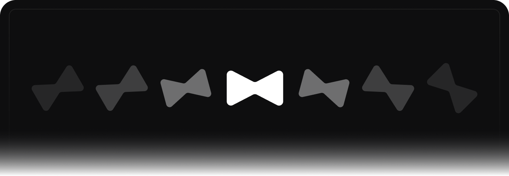

<picture>
  <source media="(prefers-color-scheme: dark)" srcset="./assets/jarvis_banner_git_dark.png">
  
</picture>

## Get Involved
We welcome contributions from the community to make Project Name even better. Detailed instructions on how to contribute can be found in each individual repository related to the project.

## Finding Resources
For additional project resources, including documentation, guides, and tutorials, please visit our official website at [https://jarvisci.com/developer](https://jarvisci.com/developer)

## Downloading Verified Builds
To download verified builds of Project Name, please visit our official download page at [jarvisci.com/download](https://jarvisci.com/download). These builds are thoroughly tested and certified for stability and security, ensuring you get a reliable version of our software.

We appreciate your support and look forward to your contributions to the Project Name community!