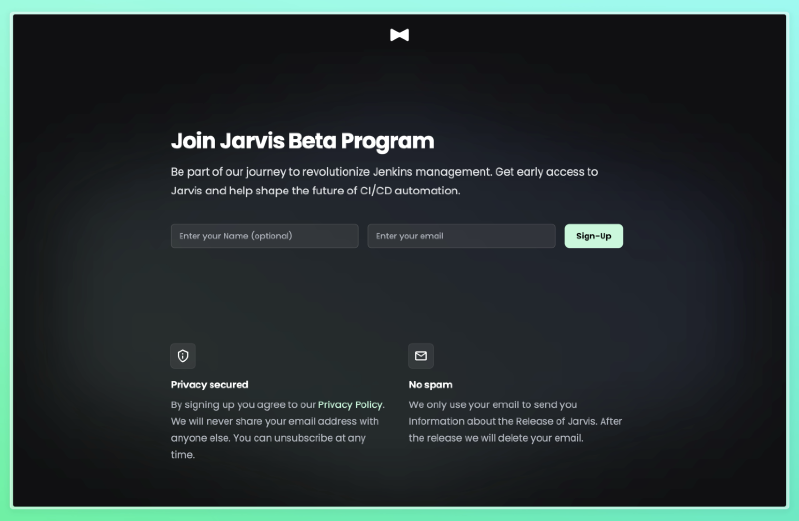

👋 Thank you for visiting our GitHub organization profile. We're excited to have you here!

## About Jarvis

🤖 **Jarvis** is currently in development. It's an intelligent automation and CI/CD tool designed to streamline your development workflow.

🚀 With the release of Jarvis v1.0, we'll be making all our repositories public, allowing you to access and contribute to our codebase.

## Join the Beta Program

🔥 You don't have to wait to get a taste of Jarvis! You can sign up for our beta program right now at [https://jarvisci.com/beta-sign-up](https://jarvisci.com/beta-sign-up). By joining the beta program, you'll have the opportunity to be one of the first to experience Jarvis and provide valuable feedback to help us improve it.

🌟 We can't wait to share Jarvis with you and the broader development community. Stay tuned for updates, and thank you for your interest and support!

Happy coding! 🚀👨‍💻👩‍💻
